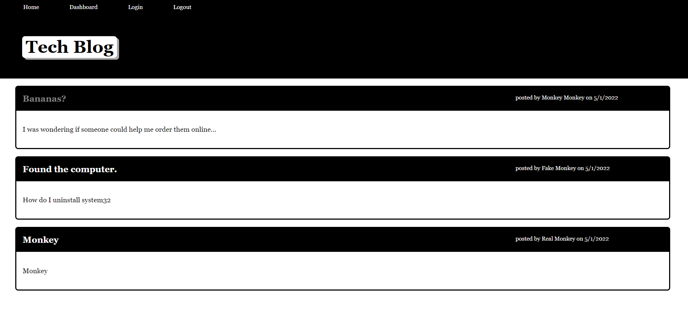

# SubmitRocket

  

  #### Table of Contents
  
  1. [Description](#description)
  2. [Installation Instructions](#installation-instructions)
  3. [Usage](#usage)
  4. [Test Instructions](#test-instructions)
  5. [License](#license)
  6. [Credits](#credits)
  
  ## Description
  * Welcome to User Tech Blog! This is a website where the user can create an account to post and comment with other users. It was developed with Node.js using the following NPM packages:

    * express, express-session, express-handlebars
    * sequelize, connect-session-sequelize, dotenv
    * mysql2
    * bcrypt

  
  
  ## Installation Instructions
  * In order to install and use this program locally, you must have node.js installed first. Download this repository and access it in your terminal of choice. When you are in the root folder enter "npm install" in the terminal to install all necessary packages. Be sure to fill out the env.EXAMPLE file and put your mySQL username and password, then rename the file to just ".env". In the terminal, log in to mySQL and type "source db/schema.sql;" to set up the ecommerce database. Then, exit mySQL and in the terminal type "npm run seed" to add starting data. Afterwards, type "npm start" into the prompt to begin the program. 
  
  This program has also been deployed through Heroku, which you can access here: (https://sleepy-lake-16227.herokuapp.com/)
  
  ## Usage
  * Use this website to ask questions about tech (or any topic really) and answer other people's questions by leaving a comment.
  
  ## Test Instructions
  * No testing through Node, but you can use Insomnia to test API endpoints.
  
  ## License
  * The application is covered under the following license:
    [mit](https://choosealicense.com/licenses/mit)
  
  ## Credits
  * This project was created by: Jake Keebler (github: jakekeebler | email: jakekeebler@gmail.com)